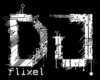

**DJFLIXEL** is a set of tools and helpers for [HaxeFlixel](https://github.com/HaxeFlixel/flixel). This is **NOT** a framework, you can easily use the parts you need in your existing or new projects.

##  VERSION 0.4 (2020) :pushpin:

[DOWNLOAD SHOWCASE DEMO HERE, FOR WINDOWS](https://1drv.ms/u/s!AodMzJWOMf3gmRlISOGsYfaQMIdh?e=zrdmSV)

**Breaking changes** from last version. I completely scrapped some parts and rewrote other parts. The code is now organized differently, and the namespaces have changed. The core objects (*`FlxMenu`, `FlxAutotext`, etc*) are there but the way you use them has changed a bit. djFlixel now declares a single global static class `D` and from there you can access some of the components like controls, alignment helper, text generation, and more.

> *e.g.* `D.align` *object is where you can find all the alignment functions.*


#### New since 0.3

- **`D`** global static class providing quick access to some helper objects.
- **`FlxSlides`** class is a way to present sprites in pages. They are animated on/off automatically
- **Bugfixes**, plus many parts have been refactored / re-written.  The library makes more sense now as a whole.
- All built-in images *(icons,buttons)* are now in a single atlas image.


#### Removed since 0.3

- Online API for gamesites, like newgrounds, kongregate, gamejolt **-- Too complex to keep up with it  --**

- Trophies and Leaderboards **-- Require online APIs to work --**

- Bullet Groups **-- Too immature --**

- MapTemplates and Streamable Sprites **-- Too specialized --**

- Toast Popup **-- Too specialized and immature --**


#### :snail: IMPORTANT NOTICE for Old Versions

I am resetting the git history, meaning that all old versions are removed from the commits. However, the previous`0.3` version is available to download in the releases tab here on GitHub.  **Why?** The commits and code were 🍝 and I wanted a clean start.


## :star: DJFLIXEL Main Features :star:

### FlxMenu

  

A multi-page menu system. Useful to create main menus and option menus. It's very simple to setup and use. Supports **links**, **checkboxes**, **list selection**, **number selection (float, ints)**. Almost everything is customizable from the cursor image, alignment, colors, animation times and more.

---

### FlxAutotext

  

Versatile autotype text object that supports a simple inline **tagging** system. Meaning that you can insert special tags in the source string and change the behavior on the fly. You can change the speed, add pauses and even trigger callbacks. 

---

### Global DJFLIXEL Helper Object

djFlixel offers the Static Class **D** for accessing some minor objects and helpers. It is available in the package `djFlixel.D`  
What is included in `D` :

- `D.snd` : Offers some sound functions, like playing assets with only the short filename or setting predefined volumes for sounds
- `D.ctrl` : Streamlined control polling. Check once and get gamepad/keyboard presses. Also ability to change keymap
- `D.save` : Save functions helper.
- `D.dest` : Helper object offering extra destroying functions, like tweens, or timers (*Use it like FlxDestroyUtil*)
- `D.assets` : Used in development, tries to load/reload assets from their real path so that you can make changes without having t to recompile the program again. Just do an asset reload, reset the state, and new assets will be fetched *(Most useful for `.json` and other configuration files)*
- `D.text` : Offers quick generation of flxText objects with custom styles. Provides its own text styling struct. The entirety of djFlixel relies on this object to get and style flxTexts
- `D.align` : Tools to align flxSprites. Align then in relation to the screen or to each other on in columns. Offers many options.
- `D.ui` : UI related helpers. Provides generation of the build-in djFlixel icons. 
- `D.bmu` : General purpose BitmapData Manipulation tools.
- `D.gfx`: Flixel/djFlixel specific Bitmap Manipulation tools. *-- There is a reason this is separate from `D.bmu` --*

---

### FX Package

In the folder/package `djflixel/gfx` you can find some tools for creating various effects like static, rainbow loader, starfield, text sine scroller, text bouncer etc. All of the effects offer many customization options.

|  |  |                  |
| ------------------------------------- | ----------------------------------------------- | ------------------------------------------------- |
|        |            |            |
|      |      |  |

  <sup>Some of the effects</sup>

---

### Others

#### Icons

djFlixel has some built-in general use icons. Icons come in sized of `8,12,16,24` pixels wide and tall. Icons are accessible from the `D.ui` object. **Also** , you can use the bitmap tools in `D.bmu` to colorize the icons. 

  

```haxe
// Sprite icon of a heart colored red
var ic = new FlxSprite(D.bmu.replaceColor(D.ui.getIcon(16,'heart'),0xFFFFFFFF,0xFFFF0000));
```

#### Slice9 Tile mode Scaling 

In the tool `D.bmu` you can find a useful **slice9** scaler, that works by tile-repeating the inner parts, It generates `bitmapdata` objects so you can use it however you want.  

 


### DEMO

In the `/demo` folder you can find the sources for a demo program that will showcase many components of the library. You can download a [binary here (Windows Only)]([DOWNLOAD SHOWCASE DEMO HERE, FOR WINDOWS](https://1drv.ms/u/s!AodMzJWOMf3gmRlISOGsYfaQMIdh?e=zrdmSV))


### Notes on some library source files

In the source files you will find two extra namespaces `djA` and `djfl`. 

- `djA` includes some target agnostic code. Code that can be used in all HAXE targets, like nodejs.
- `djfl` includes code that is specific to OpenFL.

Those are partial personal libraries that I use in some projects, but I'll probably never going to publish. So I did a copy paste of the specific files djflixel uses and put them in a proper namespace folder structure, so djFlixel compiles. And that I don't have to alter anything for my own projects when I include the libraries with `<haxelib name="djA"/>`


## About the Project

**DJFLIXEL version** : 0.4 , **License** : MIT  
**Requires** : Haxe 4.1.3, HaxeFlixel 4.7.0  
**Author** : John Dimi 2016-2020

This library started as a helper for my projects, but later decided to open source and distribute it.  
Please note that this is just a side project of mine and I cannot guarantee any support or bugfixes.   
I have **tried** to provide meaningful comments throughout the source files, also make sure to checkout the **demo** in the `/demo` folder for a full working example of using the library.

Thanks for checking this out :smile_cat:,  
John.