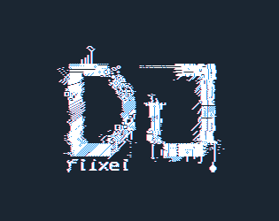
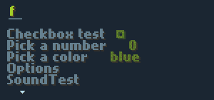
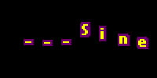
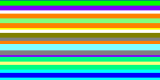
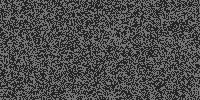
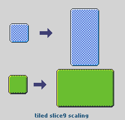

> :star: **NEW UPDATE** (2023-04) `V0.5.5` See [Announcement](https://github.com/john32b/djFlixel/discussions/20)  
> :star: **NEW UPDATE** (2023-03) `V0.5.4` Breaks a few things. Checkout the [Changelog](#dna-changelog) below

# 🔦 What is it

**djFlixel** is a small library with some helpful tools for [HaxeFlixel](https://github.com/HaxeFlixel/flixel). It started as a helper for my personal projects. One of the first things that I implemented was a **menu system** and a **text autoscroller**. Then I kept adding things, like a tool to fade the screen to black, or a unified  keyboard/gamepad checker. Later on I decided to open source and distribute it, why not. 



The codebase is commented, and I hope that you may find it easy to use. Plus I made a **demo showcase app** that utilizes most of the parts of **djFlixel**; you can find the demo source files in the `/demo` folder.

**Checkout the HTML5 version of the DEMO here: https://john0032.itch.io/djflixel** :point_left: :point_left:

### Install

```sh
haxelib git djFlixel https://github.com/john32b/djFlixel
```

<!------------------------------------>

# 🧰 Main Features

## FlxMenu

  

A multi-page menu system. Best used for creating short game menus. It is simple to setup and use. Supports **links**, **checkboxes**, **list selection**, **number selection**. It offers a simple callback system to get events *(like when an item was changed or focused)*. Also the visual style is customizable from the colors, fonts, animation times, tween offsets to custom cursors, etc. *(Examples in the Demo project source code)*


## FlxAutotext

  

An autotype text object that supports a simple inline **tagging** system. Meaning that you can insert special tags in the source string that change the behavior on the fly, like adding pauses, triggering user callbacks or changing the character speed.


## FX Package

In the folder/package `djflixel/gfx` you can find some tools for creating various effects like static, rainbow loader, starfield, text sine scroller, text bouncer etc. All of the effects offer many customization options. Checkout the **DEMO**, it provides examples on how to use most of these.

|  |  |                  |
| ------------------------------------- | ----------------------------------------------- | ------------------------------------------------- |
|        |            |            |
|      |      |  |

  <sup>Some of the effects</sup>


## Global djFlixel Helper Object `D`

**djFlixel** offers the public static class `D.hx` for accessing some minor objects and helpers. It is available in the package `djFlixel.D`  

**What is included in `D`** :

- `D.ctrl` : Streamlined control polling. Check once and get gamepad/keyboard presses. Also able to change to change keyboard keymap on the fly
- `D.snd` : Offers some sound functions, like playing assets with only the short filename or setting predefined volumes for sounds
- `D.bmu` : General purpose **openFL** BitmapData Manipulation tools.
- `D.gfx`: **flixel/djFlixel** specific Bitmap Manipulation tools.
- `D.text` : Offers quick generation of `FlxText` objects with custom styles. Provides its own text styling struct. The entirety of **djFlixel** relies on this object to get and style text objects.
- `D.align` : Tools to align `FlxSprites`. Align in relation to the screen or to each other or in columns, etc
- `D.ui` : UI related helpers. Like an icon generator (built-in **djFlixel** icons)
- `D.save` : Save functions helper.
- `D.dest` : Helper object offering extra destroying functions, like tweens, or timers (*Use it like FlxDestroyUtil*)


## ⛓️ Other

There are other small tools in this libary. Like in the `djflixel/gfx/pal` package you will find some Color Palettes, like DB32. Or a class `DelayCall` which makes it easy to delay a function call. Feel free to explore the codebase and as always read the `demo/` source, which utilizes most of these.

### Icons

**djFlixel** has some built-in general use icons. Icons come in sized of `8,12,16,24` pixels wide and tall. Icons are accessible from the `D.ui` object. **Also**, as with any other white bitmap, you can use the bitmap tools in `D.bmu` to colorize these or apply shadows.

  

<!-- ```haxe
// Sprite icon of a heart colored red
var ic = new FlxSprite(D.bmu.replaceColor(D.ui.getIcon(16,'heart'),0xFFFFFFFF,0xFFFF0000));
``` -->

### Slice9 Tile mode Scaling 

In the tool `D.bmu` you can find a useful **slice9** scaler, that works by tile-repeating the inner parts, It generates `bitmapdata` objects so you can use it however you want.  

 

<!------------------------------------>

# 📄 Notes 

### Games with Source Code
:sunflower: **NEW**, Checkout the Source Code of **FUTURE KNIGHT DX**, a game that uses djFlixel for the Menu System among other things  
https://github.com/john32b/futureknightdx

<!-- ### Games using this library
Tomb Explorer : https://john0032.itch.io/tombexplorer  
Future Knight Remix : https://john0032.itch.io/futurek  
:exclamation: *If you have a program that uses this library, pm me and I'll add it here.* -->

### Project status and future
Please note that this is just a side project of mine, I cannot guarantee any support or bugfixes. **This library is provided "as-is"**

###  Is there any documentation?
Yes, but only inside the the source code. :see_no_evil: . For practical examples checkout the `demo/` directory, it is an application that puts many of the components in use; it is heavily commented and I hope it explains things well. Also the library files themselves are commented. So feel free to dive into the codebase. :badger:

> **I have no plans to make a wiki or any other form documentation for this library.**

<!------------------------------------>

# :dna: Changelog

**- V0.5.4 (2023-03)** 
```text
== very few breaking changes ==
FlxMenu:
  - Changed a few fields for declaring the custom style objects (FlxMenu.STP)
  + 'focus_anim' replacing 'focus_anim', is an object
     that supports more options, like animating on the y axis
  - 'cursor' field now takes more animation options, check <MCursorStyle>
  - 'background' is now an object that takes {color,padding}
  + 'lerp' is a new parameter, that handles the speed of a centered
     item that changes width and needs to reorient itself
  + Ability to customize the "popup questions" menu with "FlxMenu.popSTo"
  . Few bugfixes, the mouse will now trigger range/list items with precision 
  
>> For any breakage: consult the source code and the compiler. 
   it should be very easy to adopt to the new version.
```

**- V0.5 (2022-08)** 
```text
== Breaking changes from v0.4 ==
  - FlxMenu, changed way you declare pages and items
  - FlxMenu bugfixes, and a new plugin system
  - FlxAutotext, bugs fixed
  - FlxMenu, changed the way styles are processed/stored. Styles are more unified now
  - D.snd breaking changes, there is a new better way to declare sound assets
  - StaticNoise is now working in HTML5
  - D.assets, rewrite and partially depracating it
  - NEW: FlxToast, brought back from v0.3
  - DelayedCall, changed init parameter order
  - D.text HTML5 tall font hack-fix
  - Refactored code in MItemData, it is way better now
  - Updated the DEMO
  - General code cleanup, and more that smaller things I don't remember
```

<!------------------------------------>

# 📮 Closing

### Notes on some library source files
- In the source files you will find two extra folders/namespaces `djA` *(Target agnostic library)* and `djfl` *(Openfl library)*. Don't worry about those, they are partial personal libraries that are not published but djFlixel uses. So I am bundling the files needed to compile.

### Issues?
- It seems to be that some fonts don't work well in **HTML5**, they appear to produce taller text objects than the other targets, and this throws off all the automatic positioning a bit. `FlxMenu` and `FlxAutotext` are affected. However I tried to implement a **hack/fix** for such cases. Readup on `MPageStyle` and `DTextStyle`, plus check the `demo/` sources for an application example.

### About
I started creating this library in 2015-2016, recently I reseted the commit history to a fresh start. The older versions prior to 0.4 are available in the TAG releases here on GitHub.

Thanks for checking this out 😸,  
John.

---

**djFlixel** : **0.5.4** *(2023-03)*  | **Author** : john32b  | **License** : MIT 